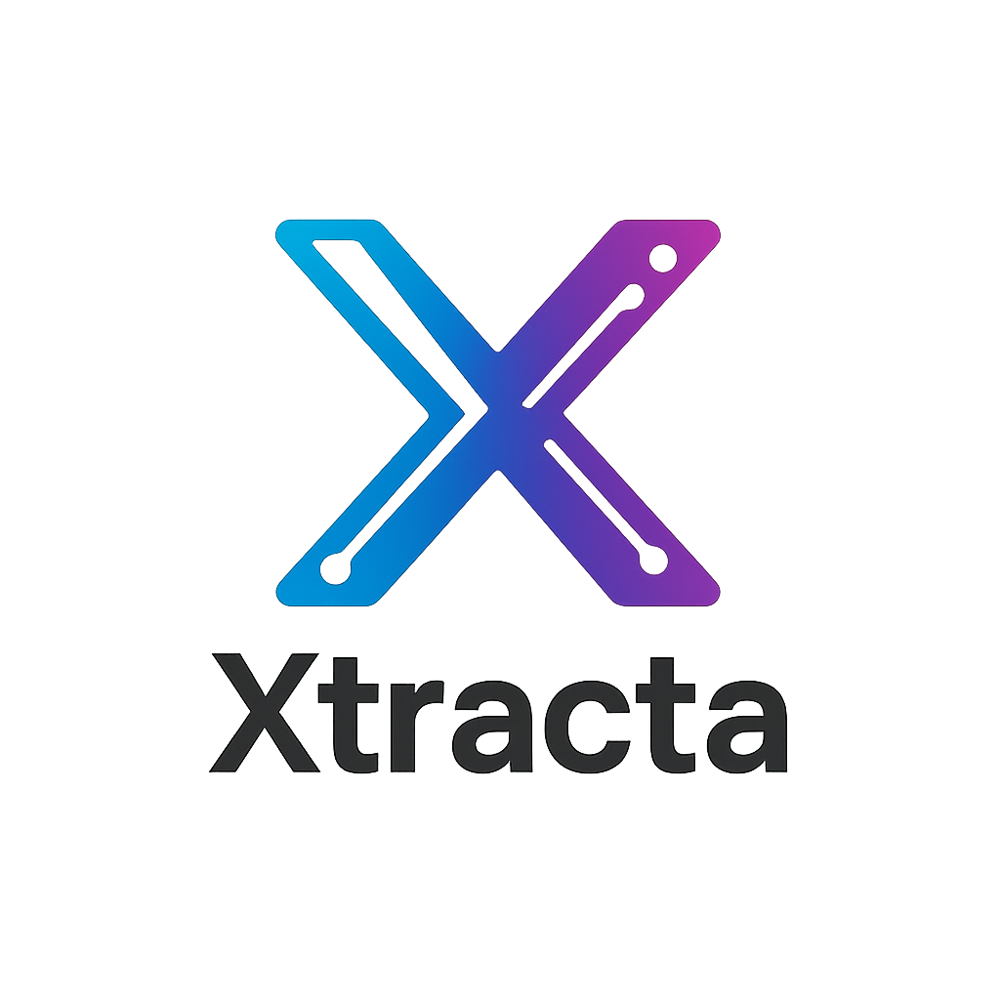
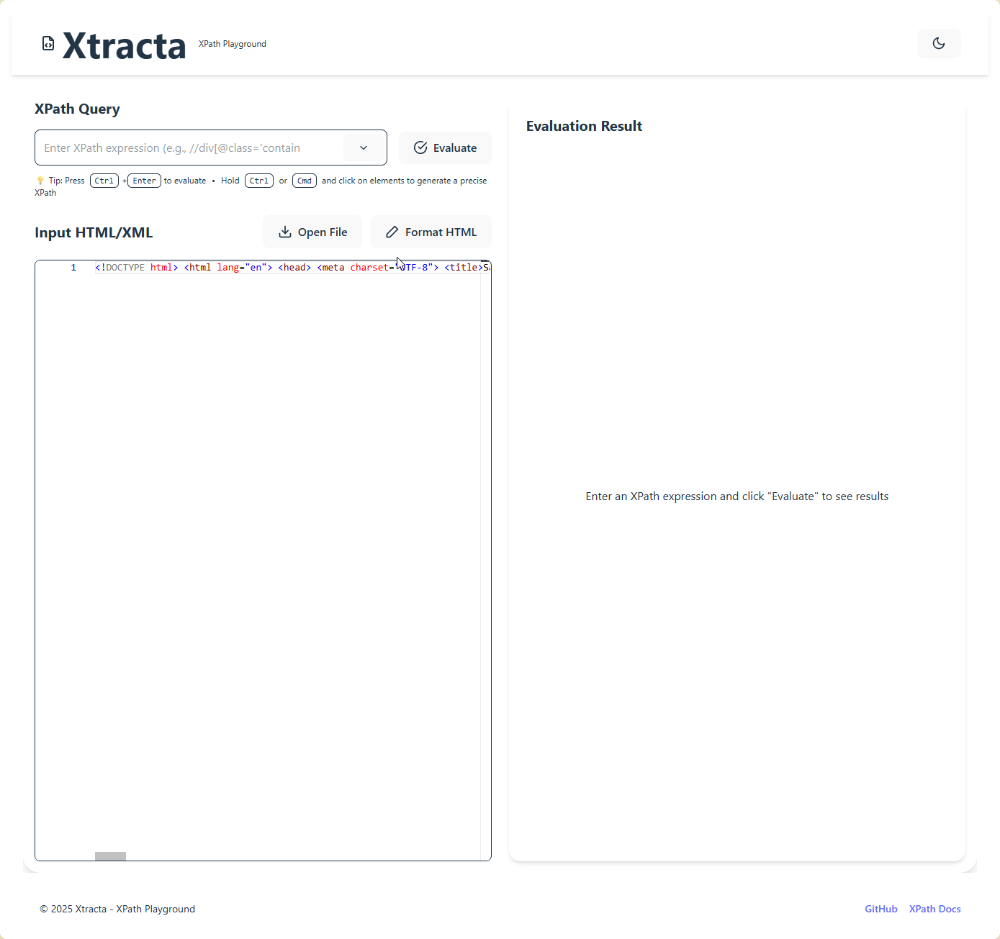
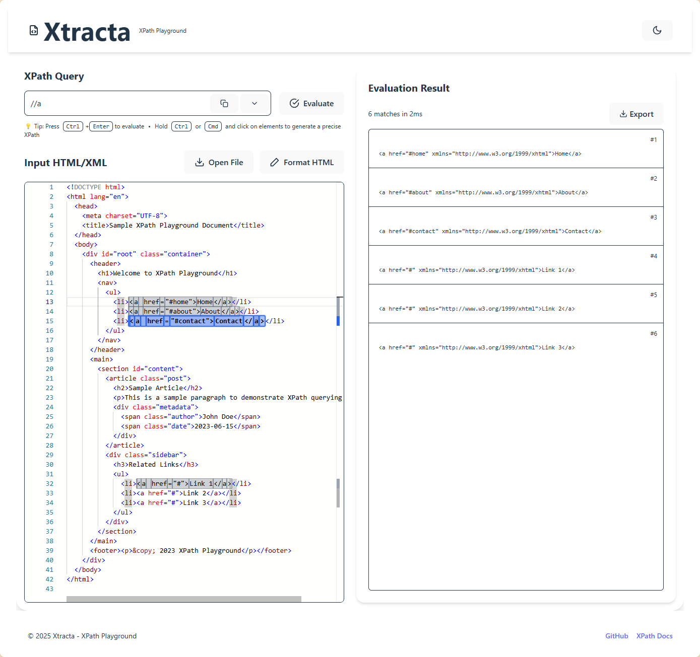

<p align="center">
  
</p>

<h1 align="center">Xtracta</h1>
<h3 align="center">The Modern XPath Testing Playground</h3>

<p align="center">
  <a href="#features">Features</a> •
  <a href="#live-demo">Live Demo</a> •
  <a href="#quick-start">Quick Start</a> •
  <a href="#why-xtracta">Why Xtracta</a> •
  <a href="#screenshots">Screenshots</a> •
  <a href="#development">Development</a> •
  <a href="#license">License</a>
</p>

<p align="center">
  
</p>

---

## About Xtracta

**Xtracta** is an open-source XPath playground designed for developers, testers, and data analysts who work with HTML and XML documents. Built with modern technologies including React 19, TypeScript, Tailwind CSS, and Node.js, Xtracta provides a powerful yet intuitive interface for testing and refining XPath expressions with real-time feedback.

## Features

✨ **Advanced Editor Environment**
- Syntax highlighting for HTML/XML and XPath
- Line numbers and error indicators
- WebAssembly-powered formatting for optimal performance
- Real-time XPath evaluation with highlighted results

🚀 **Powerful XPath Tools**
- Interactive node selection with automatic XPath generation
- Click-to-XPath: generate expressions by clicking on elements
- XPath history tracking with result counts
- Detailed result view with node context

🔄 **Seamless Workflow**
- Pretty-print or minify XML/HTML with a single click
- Export matched nodes as standalone XML/HTML
- Keyboard shortcuts for all common operations
- Hover-to-XPath for quick node targeting

💻 **Developer-Friendly**
- Cross-platform compatibility (macOS, Windows, Linux)
- Full keyboard navigation and accessibility features
- Docker support for easy deployment
- Extensible architecture with plugin support

## Live Demo

Try Xtracta now at [xtracta.dev](https://xtracta.dev)

## Quick Start

### Using Docker

```bash
docker pull xtracta/xtracta
docker run -p 3000:3000 xtracta/xtracta
```

### Local Installation

```bash
git clone https://github.com/mnhlt/Xtracta.git
cd xtracta
npm install
npm start
```

Then open [http://localhost:3000](http://localhost:3000) in your browser.

## Why Xtracta

XPath is a powerful language for navigating XML and HTML documents, but testing expressions can be challenging without the right tools. Xtracta addresses these challenges by providing:

- **Real-time feedback** - See exactly which nodes match your expressions as you type
- **Interactive learning** - Generate XPaths by clicking elements to learn by doing
- **Performance optimization** - WebAssembly-powered processing handles large documents with ease
- **Modern UX** - Clean, intuitive interface designed for productive workflows

Whether you're scraping websites, parsing XML APIs, or automating tests, Xtracta helps you build and validate XPath expressions with confidence.

## Screenshots

<p align="center">
  
</p>

## Development

For development setup and contribution guidelines, see [DEVELOPMENT.md](DEVELOPMENT.md) and [CONTRIBUTE.md](CONTRIBUTE.md).

## License

MIT

---

<p align="center">Made with ❤️ by the mnhlt</p> 